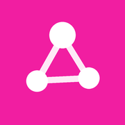
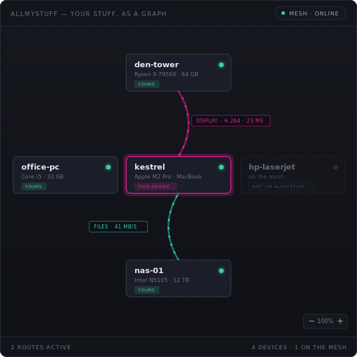

<div align="center">



# AllMyStuff

Remote desktop, shell, and files for every computer you own — over a private mesh.

[](https://github.com/mrjeeves/AllMyStuff/releases)
[](LICENSE)
[](#installation)
[](https://github.com/mrjeeves/MyOwnMesh)



</div>

AllMyStuff is a desktop app that links the computers you own into a single
private network. From one window you can watch and control any machine's screen,
open a terminal on it, and move files between them — without setting up a VPN,
forwarding ports, or signing into a cloud service. It scans each machine's
hardware automatically and lays everything out as a graph you click through.

It's free, open source, and runs on macOS, Linux, and Windows.

## Features

- **Remote desktop.** View and control any machine's screen at up to 4K, with
  one tab per monitor. Keyboard and mouse pass through, so a remote machine
  works as if you were sitting at it.
- **Remote shell.** Open a real terminal on any of your machines. No SSH daemon,
  keys, or port forwarding to set up — it runs over the mesh. There's also a
  command-line terminal, **AMSTerm** (`amst`): `amst <machine>` drops
  you into a shell on any machine you own, right from your own terminal, and a
  bare `amst` opens one on this machine. It comes with AllMyStuff (see below).
- **Shared terminals.** A shell session more than one machine can attach to at
  once, tmux-style — `amst <machine> -s` lists a machine's open shells, and
  `-a <id>` joins one.
- **Clipboard sync.** While controlling a machine, the clipboard follows you:
  paste sends yours to the remote, copy brings the remote's back — text,
  images, and files.
- **File access.** Browse, preview, and transfer files between machines.
  Downloads land straight on your disk; nothing routes through a third party.
- **Automatic discovery.** Each machine reports its hardware and attached
  devices — displays, cameras, microphones, disks — and they appear on the
  graph, ready to connect. Claiming a new device is LAN-first: it offers
  itself for adoption only over a local, mDNS-only rendezvous — never the
  public mesh unless you switch that on at the device itself.
- **Fleets.** Every device you claim joins your fleet: one identity across all
  of them, linked by a shared fleet key, with cryptographically signed
  membership in three tiers — owner, manager, member.
- **Sharing with people.** Grant one capability — a screen, a camera, files —
  to a person, not a machine: it works from whichever of their devices is
  handy, and you can revoke it at any time.
- **Virtual rooms.** Bring several machines into one call, with invites or
  knock-to-join and a chat alongside; the media itself still flows directly
  between members.
- **Sites.** Open a machine's local web service in your browser — even one
  bound to loopback — through a port mapped on the machine you're sitting at.
  Only ports the host advertises are ever proxied.
- **KVM appliances.** Point a NanoKVM-class device at a machine and you can
  reach its screen and keyboard even when its OS is down — BIOS included —
  with power and reset a click away; the KVM's own web UI opens through the mesh.
- **Peer-to-peer and encrypted.** Traffic flows directly between your machines
  over an end-to-end encrypted mesh. There is no central server holding your
  data.
- **Headless mode.** Put a machine with no screen on the graph with
  `allmystuff serve`, and keep it there across reboots as a system service.

## Installation

**macOS and Linux**

```sh
curl -fsSL https://allmystuff.works/install.sh | sh
```

**Windows**

```powershell
irm https://allmystuff.works/install.ps1 | iex
```

The installer downloads the verified binaries, adds `allmystuff`, `amst`, and the
desktop app to your `PATH`, and sets up the [MyOwnMesh](https://github.com/mrjeeves/MyOwnMesh)
daemon the app runs on. Pre-built bundles (`.dmg`, `.msi`, `.deb`, `.AppImage`)
and portable archives are on the
[releases page](https://github.com/mrjeeves/AllMyStuff/releases).

### AMSTerm (`amst`) — the terminal

**AMSTerm** is the command-line terminal — a real shell on any machine you own,
over the mesh. It **comes with AllMyStuff**: the installer above drops the `amst`
command on your `PATH`, adds an **AMSTerm** app launcher (and, on Windows, a
desktop + Start Menu shortcut and an **"AMSTerm here"** right-click menu on
folders) — no separate install. `amst` is a client of this machine's AllMyStuff
node; if none is running it opens the desktop app to bring one up (or, on a
headless box, starts a headless node directly and says so).

## Getting started

The app opens to a populated demo graph, so you can explore the interface
without connecting anything first.

To use it for real, install AllMyStuff on each computer you want to reach. They
discover one another and appear on the graph. Click a machine to see its
hardware, then open a session:

- **Screen** to watch or control it,
- **Terminal** for a shell,
- **Files** to browse and transfer.

For a machine without a display — a home server, a build box — run
`allmystuff serve` to put it on the graph headless, or `allmystuff service
install` to keep it running across logins and reboots.

## How it works

AllMyStuff is written in Rust, with a [Tauri](https://tauri.app) and
[Svelte](https://svelte.dev) desktop interface. It runs as a client of the
[MyOwnMesh](https://github.com/mrjeeves/MyOwnMesh) daemon, which handles peer
identity, discovery, and encrypted transport — so connections are direct and
work through NATs without manual port forwarding.

The networking engine — presence, session setup, and the screen, audio, input,
terminal, and file channels — lives in one Rust crate that both front ends
share: the desktop app and the headless `allmystuff serve` binary run the same
code. The device graph and its routing rules are pure Rust, mirrored to
TypeScript so the UI stays interactive on its own.

See [ARCHITECTURE.md](ARCHITECTURE.md) for the full design and crate layout.

## Project status

AllMyStuff is under active development. What works today:

| Area | Status | Notes |
|---|---|---|
| Device scanner | ✅ | Linux, macOS, and Windows; built and tested on all three in CI |
| Desktop graph UI | ✅ | Interactive on both demo and live data |
| Remote desktop | ✅ | Hardware-encoded H.264 up to 4K (VideoToolbox on macOS, Media Foundation on Windows), with software and MJPEG fallbacks; keyboard and mouse passthrough |
| Remote terminal | ✅ | A real PTY per tab over the mesh; no SSH daemon required |
| File access | ✅ | Browse, preview, upload, download, rename, delete; bulk transfers stream in chunks with backpressure, straight to disk |
| Audio and camera | ✅ | Opus audio and H.264 camera over the same transport |
| Discovery and routing | ✅ | Peers appear via presence; sessions negotiate and tear down cleanly |

## Building from source

```sh
just setup    # one-time: Rust, Node, pnpm, and GUI dependencies
just dev      # run the app with hot reload
```

The CLI reference, platform requirements, and notes on helping test macOS,
Windows, and Raspberry Pi builds are in [CONTRIBUTING.md](CONTRIBUTING.md).

## License

[MIT](LICENSE).
