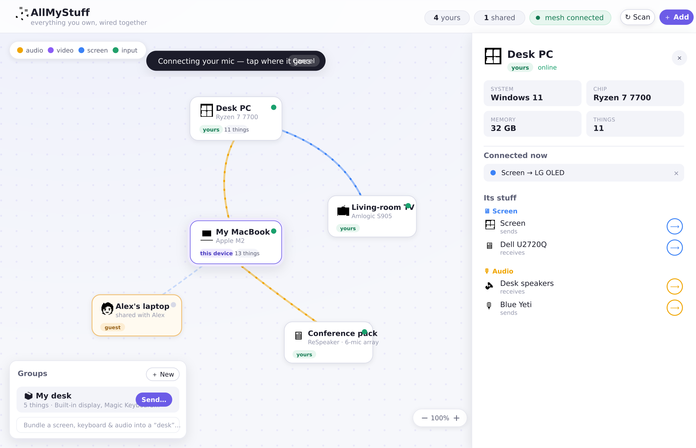

<div align="center">


# AllMyStuff

### All my stuff. Works. — _yours can too._

**Every screen, shell, and file you own — on one map, one tap away.**

A free desktop app that finds all your machines and wires them together, so you
can drive any of them from whichever one is in your hand. No accounts, no
subscriptions, no VPN to set up.

<br/>

[](LICENSE)
[](https://github.com/mrjeeves/MyOwnMesh)
[](#install)
[](#how-it-works)
[](#wait-how-is-it-free)
[](https://github.com/mrjeeves/AllMyStuff/releases)

**[Why](#why)** · **[Install](#install)** · **[What you get](#what-you-get)** · **[Free?](#wait-how-is-it-free)** · **[How it works](#how-it-works)** · **[Status](#status)** · **[Build](#build)**

<br/>



<sub>Your living-room TV, your home server, your work laptop — one map. Tap a screen to watch it; tap a machine to open its shell.</sub>

</div>

---

## Why

You already own the machines. Reaching them shouldn't take a remote-desktop
account, an ssh key, a port-forward, *and* a VPN subnet — one tool for each job,
half of them billed monthly.

AllMyStuff puts every machine you own on **one graph** and lets you reach
straight into any of it. Open the app and your stuff is just *there*.

| You want to… | The usual way | AllMyStuff |
|---|---|---|
| See another machine's screen | a remote-desktop account, often a paid seat | tap the screen |
| Open a shell on it | `sshd` + keys + a port-forward | tap **Terminal** |
| Grab a file off it | `scp`, or a cloud drive in the middle | tap **Files**, drag it over |
| Reach it from outside the house | a VPN subnet + firewall rules | it's already on your graph |
| Pay for all of that | a stack of subscriptions | **$0** |

## Install

One command. It detects your platform, verifies SHA-256, and puts `allmystuff`
and the desktop app on your PATH. No account, no card — not even at install.

```sh
# macOS / Linux
curl -fsSL https://allmystuff.works/install.sh | sh
```

```powershell
# Windows
irm https://allmystuff.works/install.ps1 | iex
```

It opens straight into a populated **demo graph** — no setup, no mesh — so you
can click around the whole thing before it ever touches your real machines.

<details>
<summary>The mesh comes along (there's no second command)</summary>

<br/>

Live machines run on a [MyOwnMesh](https://github.com/mrjeeves/MyOwnMesh)
daemon, and the installer handles it: a recent enough `myownmesh` is used as-is,
an older one updates itself, a missing one is installed next to the app — and
the app keeps it current from then on. Pass `--no-mesh` / `-NoMesh` to skip it,
`--no-gui` / `-NoGui` for a headless box. Bundles (`.deb` / `.AppImage` /
`.dmg` / `.msi`) and portable tarballs live on
[Releases](https://github.com/mrjeeves/AllMyStuff/releases).

</details>

## What you get

### 🖥️ Remote desktop, no account

Watch and drive any machine's screen — **H.264 up to 4K**, one tab per monitor.
Your keyboard and mouse become its keyboard and mouse, smooth enough to play
your tower from a laptop on the couch.

### ⌨️ A real shell, instantly

Open a terminal on any machine you own and the far side spawns your actual shell
in a real PTY. **No `sshd`, no keys, no port-forwarding** — it just opens.

### 📁 Your files, everywhere

Browse, preview, rename, and pull files off any machine. Downloads land
**straight on your disk** — never routed through anyone's cloud.

### 🕸️ One map of it all

AllMyStuff scans each machine for everything plugged in — screens, mics,
cameras, disks, keyboards — and lays it out as a graph you can actually read.
Click a node for its specs and its devices; drag a wire to connect them.

### 🔒 Yours, end to end

Peer-to-peer between your machines, encrypted, keys on your devices. There's no
server-side copy of your stuff because there's no server holding it. Cancel
everything and every machine keeps running the app.

## Wait, how is it free?

Because it runs on **your** hardware, not ours. The app, the mesh, and a small
always-on relay cost us almost nothing per person — so we don't bill for them.
We make money selling [hardware](https://allmystuff.works/hardware/) and a
[concierge service](https://allmystuff.works/service/) to the people who want
them; both are strictly optional and the app never needs either.

It's **complete on day one — not a trial, not a tier.** MIT-licensed, and you
can point it at your own servers and self-host the whole thing.

## How it works

A Cargo workspace of small Rust crates plus a Tauri 2 / Svelte 5 app, riding as
a **client of the `myownmesh` daemon** rather than embedding it.

- **The mesh** handles identity, discovery and transport — traffic runs
  directly between your machines, encrypted end to end, finding a path through
  NATs without you opening a port.
- **One engine, two front ends.** Presence, the route handshake, and every media
  plane (screen / camera / audio / input / terminal / files) live in `node/`.
  The desktop app links it; `allmystuff serve` links the same code, headless —
  so a box with no screen still belongs on the graph.
- **The graph model is pure, tested Rust**, mirrored to TypeScript so the UI is
  interactive on its own.

See **[`ARCHITECTURE.md`](ARCHITECTURE.md)** for the full tour and crate map.

## Status

A **working foundation**, honest about what's real. Deep per-platform detail is
in [`ARCHITECTURE.md`](ARCHITECTURE.md).

| Piece | State | |
|---|---|---|
| Device scanner | ✅ | Linux / macOS / Windows, fixture-tested, built + tested on all three in CI |
| Desktop graph UI | ✅ | Builds, typechecks, interactive on demo *and* live data |
| Remote console | ✅ | pikvm-style window per machine: live screen, camera tabs, audio, keyboard/mouse |
| Remote terminal | ✅ | A real shell on any of your machines — no `sshd`; one mesh route per PTY tab |
| Remote files | ✅ | A finder-like manager — no smb/sftp; browse, preview, upload, download, edit |
| Presence + routing | ✅ | Peers appear via presence; routes negotiate offer/accept/teardown |
| Live screen + input | ✅ | openh264 → RTP up to 4K/30 fps, MJPEG fallback; chords resolve so modifiers never stick |
| Live audio | ✅ | Opus over the mesh's RTP lane, PCM fallback; system-audio loopback or mic |
| Live camera | ✅ | Same pipe as screens (H.264 + MJPEG fallback) via nokhwa |
| Storage streaming | 🚧 Next | Routes wire and show the session; transport over the proven pipe is in flight |

## Build

```sh
just setup    # one-time deps: Rust, Node, pnpm, GUI libs
just dev      # run with hot reload
```

The full CLI reference and how to help test on macOS / Windows / Pi are in
**[CONTRIBUTING.md](CONTRIBUTING.md)**.

## The bigger picture

AllMyStuff stands on **three pillars** — only one is this repo, and the app
never needs the other two.

| | | |
|---|---|---|
| **01 · Software** | _Free, and missing nothing._ | $0 forever, open source, every feature. **You are here.** |
| **02 · Hardware** | _When the OS is dead, hardware can still answer._ | The [Access line](https://allmystuff.works/hardware/) — an out-of-band witness that keeps a crashed machine on your graph. |
| **03 · Service** | _A human on call. A network of your own._ | Optional: a real technician one tap away, or a private relay of your own. |

The whole story is at **[allmystuff.works](https://allmystuff.works)**.

## Family

- **[MyOwnMesh](https://github.com/mrjeeves/MyOwnMesh)** — the pure-Rust
  peer-to-peer mesh AllMyStuff sidecars for identity, discovery and transport.
- **[MyOwnLLM](https://github.com/mrjeeves/MyOwnLLM)** — detect hardware, run
  the best local model. AllMyStuff borrows its sidecar-the-daemon patterns.

---

<div align="center">

**[allmystuff.works](https://allmystuff.works)** · [Releases](https://github.com/mrjeeves/AllMyStuff/releases) · [Architecture](ARCHITECTURE.md) · [Contributing](CONTRIBUTING.md)

Tech that works when you turn it on. **Yours, with or without us.**

[MIT](LICENSE) · A [Critical Error Computing](https://allmystuff.works) product

</div>
